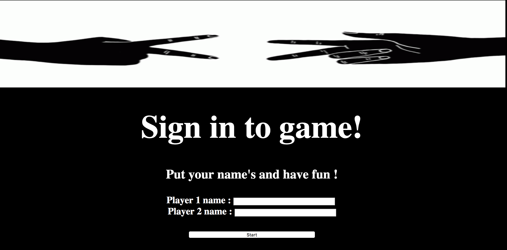

# RPS Challenge
#### how to run it ?

- Please clone this repo and then run :
```
  ruby app.rb
```



## Deployed on Heroku

[Heroku](https://acebook-unicorns.herokuapp.com/)

Task
----

Knowing how to build web applications is getting us almost there as web developers!

The Makers Academy Marketing Array ( **MAMA** ) have asked us to provide a game for them. Their daily grind is pretty tough and they need time to steam a little.

Your task is to provide a _Rock, Paper, Scissors_ game for them so they can play on the web with the following user stories:

```sh
As a marketeer
So that I can see my name in lights
I would like to register my name before playing an online game

As a marketeer
So that I can enjoy myself away from the daily grind
I would like to be able to play rock/paper/scissors
```


## Basic Rules

- Rock beats Scissors
- Scissors beats Paper
- Paper beats Rock
